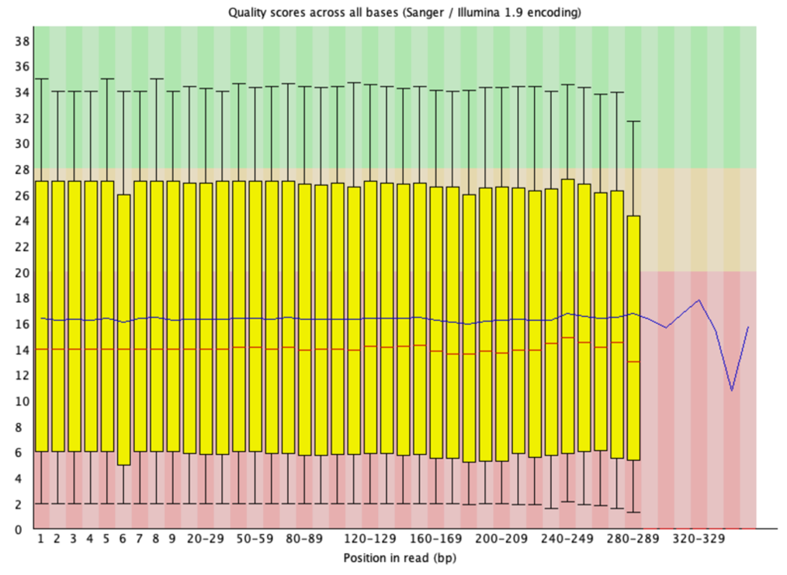
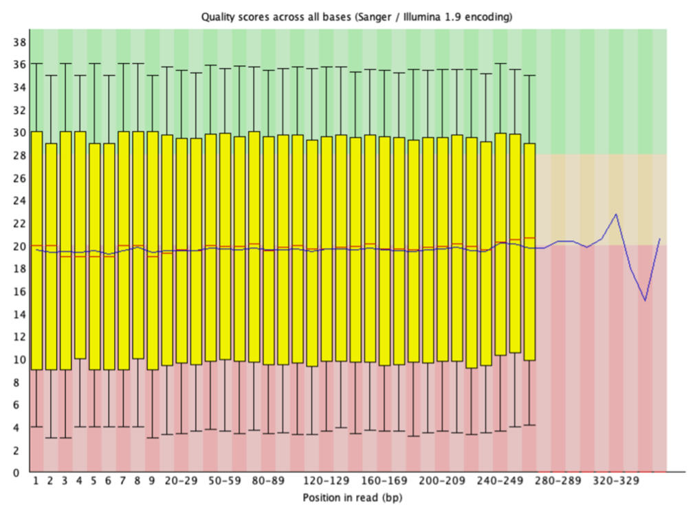
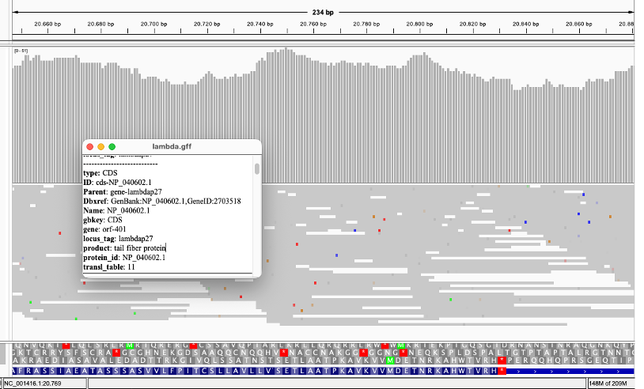

> **Note:** This study was conducted for educational purposes only.

# Reference-Based RNA-Seq Analysis of Bacteriophage Lambda using NGS Data

**Author:** Bedriye GENCER  
**Institution:** Istanbul Health And Technology University  
**Department:** Molecular Biology And Genetics  

## 1. Introduction
**Objective:** The aim of this study was to apply a quality control protocol to an RNA-seq dataset of unknown origin, remove detected low-quality reads and adapters via trimming, determine the taxonomic origin of the sequence through alignment, and identify the most highly expressed genes.

**Background:** Bacteriophage Lambda serves as a fundamental model in molecular biology for understanding genomic structure and viral gene regulation. Its small genome size offers an accessible model for sequencing and in silico analysis.

## 2. Methods
The following in silico bioinformatics pipeline was implemented:

* **Data Quality Control (QC):** Raw RNA-seq data were analyzed using **FastQC (v0.11.9)** to examine Phred scores and adapter contamination.
* **Data Trimming:** Reads with a quality score below 20 were designated as low quality. These reads and adapter sequences were removed using **Trimmomatic** with the parameters `TRAILING:20` and `MINLEN:15`.
* **Reference Genome Alignment:** Cleaned reads were aligned to the *Enterobacteria phage lambda* reference genome (NC_001416.1) using **Bowtie2**.
* **Quantification:** Aligned reads were counted at the gene level using **featureCounts** (Subread package).
* **Visualization:** Alignment depth and gene loci were visualized using **IGV**.

## 3. Results
### Quality Control
Initial FastQC analysis revealed low quality scores (mean ~16). Following the trimming process, this value increased to approximately 20.

*Figure 1: Quality control results before trimming.*

*Figure 2: Quality control results after trimming.*

### Alignment & Gene Expression
* **Alignment Rate:** 98.48% alignment to the reference genome.
* **Top Expressed Gene:** Tail Fiber Protein (ID: `lambdap27`).
* **Second Top Gene:** Tail Tape Measure Protein (ID: `lambdap16`).

*Figure 3: Snapshot obtained from IGV showing the Tail Fiber Protein gene region. Grey histograms indicate high read depth.*

## 4. Discussion
The observation of the highest expression in tail proteins suggests that the virus is in the **late stage of the lytic cycle**, assembling structural components prior to host cell lysis. IGV examination revealed single nucleotide mismatches, suggesting potential mutations or evolutionary divergence.

## 5. Tools & Skills Demonstrated
* **NGS Data Analysis:** QC, Trimming, Alignment, Quantification
* **Tools:** FastQC, Trimmomatic, Bowtie2, Samtools, featureCounts, IGV
* **Environment:** Linux Command Line, Conda

---

# Bakteriyofaj Lambda'nın NGS Verisi Kullanılarak Referans Tabanlı RNA-Seq Analizi

**Yazar:** Bedriye GENCER  
**Kurum:** İstanbul Sağlık ve Teknoloji Üniversitesi  
**Bölüm:** Moleküler Biyoloji ve Genetik  

## 1. Giriş
**Amaç:** Bu çalışmanın amacı, bilinmeyen bir kaynaktan elde edilen RNA-seq veri setine kalite kontrol protokolü uygulamak, tespit edilen düşük kaliteli okumalar ve adaptörleri kırpma yoluyla çıkarmak, hizalama yoluyla dizinin taksonomik kökenini belirlemek ve en yüksek düzeyde eksprese edilen genleri tanımlamaktı.

**Arka Plan:** Bakteriyofaj Lambda, genomik yapı ve viral gen regülasyonunu anlamak için moleküler biyolojide temel bir model olarak hizmet etmektedir. Küçük genom boyutu, dizileme ve in silico analiz için erişilebilir bir model sunmaktadır.

## 2. Yöntemler
Aşağıdaki in silico biyoinformatik işlem hattı uygulanmıştır:

* **Veri Kalite Kontrolü (QC):** Ham RNA-seq verileri, Phred skorlarını ve adaptör kontaminasyonunu incelemek için **FastQC (v0.11.9)** kullanılarak analiz edilmiştir.
* **Veri Kırpma:** Kalite skoru 20'nin altında olan okumalar düşük kaliteli olarak belirlenmiştir. Bu okumalar ve adaptör dizileri, `TRAILING:20` ve `MINLEN:15` parametreleri ile **Trimmomatic** kullanılarak çıkarılmıştır.
* **Referans Genom Hizalaması:** Temizlenmiş okumalar, **Bowtie2** kullanılarak *Enterobacteria phage lambda* referans genomuna (NC_001416.1) hizalanmıştır.
* **Kantifikasyon:** Hizalanmış okumalar, **featureCounts** (Subread paketi) kullanılarak gen seviyesinde sayılmıştır.
* **Görselleştirme:** Hizalama derinliği ve gen lokusları **IGV** kullanılarak görselleştirilmiştir.

## 3. Bulgular
### Kalite Kontrolü
İlk FastQC analizi düşük kalite skorları (ortalama ~16) ortaya koymuştur. Kırpma işlemini takiben bu değer yaklaşık 20'ye yükselmiştir.

*Şekil 1: Kırpma öncesi kalite kontrol sonuçları.*

*Şekil 2: Kırpma sonrası kalite kontrol sonuçları.*

### Hizalama ve Gen Ekspresyonu
* **Hizalama Oranı:** Referans genoma %98,48 hizalama.
* **En Yüksek Eksprese Edilen Gen:** Kuyruk Fiberi Proteini (ID: `lambdap27`).
* **İkinci En Yüksek Gen:** Kuyruk Bant Ölçüm Proteini (ID: `lambdap16`).

*Şekil 3: Kuyruk Fiberi Proteini gen bölgesini gösteren IGV'den elde edilen görüntü. Gri histogramlar yüksek okuma derinliğini göstermektedir.*

## 4. Tartışma
Kuyruk proteinlerinde en yüksek ekspresyonun gözlemlenmesi, virüsün konak hücre lizisinden önce yapısal bileşenleri bir araya getirdiği **litik döngünün geç aşamasında** olduğunu düşündürmektedir. IGV incelemesi, potansiyel mutasyonlar veya evrimsel farklılaşma öneren tek nükleotid uyumsuzlukları ortaya koymuştur.

## 5. Gösterilen Araçlar ve Beceriler
* **NGS Veri Analizi:** QC, Kırpma, Hizalama, Kantifikasyon
* **Araçlar:** FastQC, Trimmomatic, Bowtie2, Samtools, featureCounts, IGV
* **Ortam:** Linux Komut Satırı, Conda

---